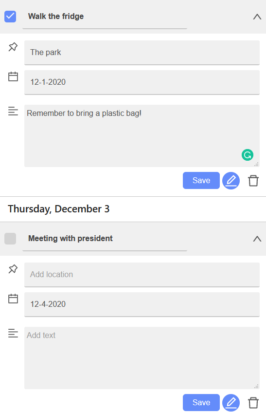
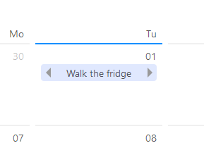

# Quick-List

Check it out [here](https://quick-list.netlify.app/) on Netlify.

A task management web application that reduces planning time by minimizing clicking and unnecessary details.
This project was bootstrapped with [Create React App](https://github.com/facebook/create-react-app).

## Technology

Created with ReactJS. Focus on learning functional components and hooks. Creating HTML and CSS components from scratch for funzies.
Calendar, icons, and badges from [antd.](https://ant.design/components/overview/)

## Installation

In the project directory, you can run:
`npm start`

## Usage

Here's an overview of how to use it and a showcase of the time-saving features implemented.

Your tasks are located on the left hand-side and also placed appropriately on the calendar. Tasks can be completed by clicking the check-box on the left.

Multiple tasks can be assigned to a date by clicking on the calendar and entering a title. This removes the need to have to re-click the calendar to add another task.

Clicking on a task reveals more information about it. There are options to edit and delete a task.

Once a task is in "edit mode," you can modify the any of the fields. Clicking on the calendar will change the date field to the appropriate date. Pressing the save button saves any modifications and exit edit mode. The pencil icon can be pressed again to disregard any modifications and exit edit mode.

Moving over to the calendar, the tasks are displayed there. Clicking on the arrows moves the task over by a day. This eases the movement of a task in the use case where you don't finish it on a particular day and want to move it to another.

Tasks are stored in local storage, so they won't disappear on refresh :D.
